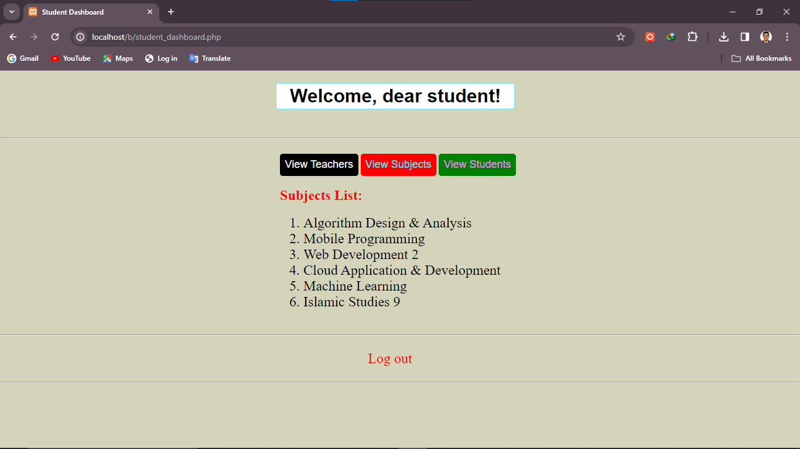
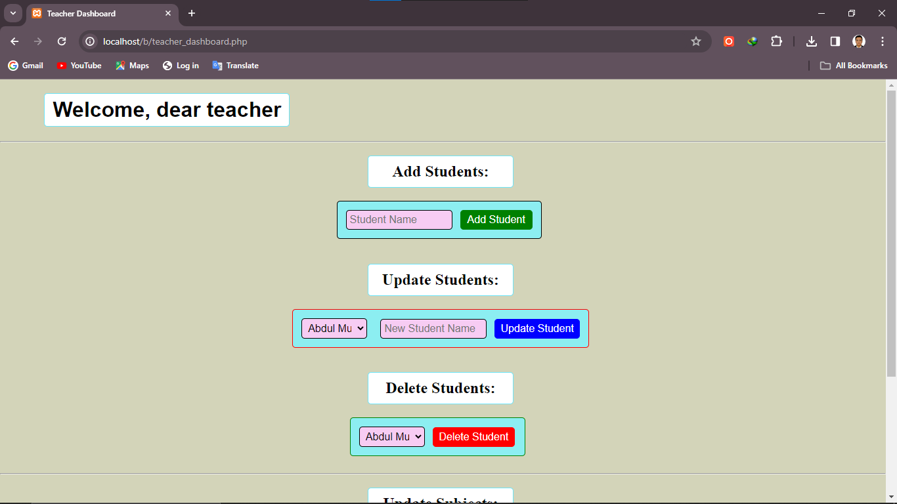

# University-Class Management System

This is a simple University-Class Management System that allows teachers to manage their academic information and allows students to view the information.  The system provides functionality for adding, updating, and deleting
students, teachers, and subjects.

## Table of Contents

- [Features](#features)
- [Getting Started](#getting-started)
- [Prerequisites](#prerequisites)
- [Installation](#installation)
- [Usage](#usage)
- [Screenshots](#screenshots)
- [Database Setup](#database-setup)
- [Contributing](#contributing)
- [License](#license)

## Features

- **Login System**: The system includes a login system for teachers and students, ensuring that only authorized users can access the system.

- **User Types**: It supports two user types, teachers, & students, each with their respective dashboards.

- **Student Dashboard**:
  - View the list of teachers and subjects.

- **Teacher Dashboard**:
  - Add, update, and delete students and update subject records.
  - View the list of students and subjects.

## Getting Started

### Prerequisites

- You need to have a web server (e.g., Apache) and a database server (e.g., MySQL) set up on your machine.

### Installation

1. Clone this repository to your local machine:

   ```shell
   git clone https://github.com/M-Zahir-Akbari/Php-Login-System-MySQL-Crud-operations.git
   ```

2. Configure your web server to serve the application from the cloned directory.

3. Set up the database.

## Usage

1. Open your web browser and navigate to the application's URL.
2. Login as a teacher or student using the provided credentials.
3. Use the dashboard to add, update, or delete records based on your user type.

## Screenshots





## Database Setup

The application uses a MySQL database. You can set up the database and populate it with sample data using the provided SQL script.

1. Create the database and tables:

   ```sql
   DROP DATABASE IF EXISTS uni;

   CREATE DATABASE uni;

   USE uni;

   -- Create the users table for authentication
   CREATE TABLE users (
       user_id INT AUTO_INCREMENT PRIMARY KEY,
       username VARCHAR(50) NOT NULL UNIQUE,
       password VARCHAR(255) NOT NULL
   );

   -- Insert sample users (teacher and student)
   INSERT INTO users (username, password) VALUES ('teacher', 'hashed_password_teacher');
   INSERT INTO users (username, password) VALUES ('student', 'hashed_password_student');

   -- Create tables for teachers, subjects, and students
   CREATE TABLE Teachers (
       teacher_id INT AUTO_INCREMENT PRIMARY KEY,
       teacher_name VARCHAR(50) NOT NULL
   );

   CREATE TABLE Subjects (
       subject_id INT AUTO_INCREMENT PRIMARY KEY,
       subject_name VARCHAR(50) NOT NULL,
       teacher_id INT NOT NULL,
       FOREIGN KEY (teacher_id) REFERENCES Teachers(teacher_id)
   );

   CREATE TABLE Students (
       student_id INT AUTO_INCREMENT PRIMARY KEY,
       student_name VARCHAR(50) NOT NULL
   );

   -- Insert sample data for teachers, subjects, and students
   INSERT INTO teachers (teacher_name) VALUES ('Dr. Hassan Adelyar');
   -- Insert more teachers and students as needed

   INSERT INTO students (student_name) VALUES ('Abdul Musawer Dinzad');
   -- Insert more students as needed
   ```

2. Make sure to replace `'hashed_password_teacher'` and `'hashed_password_student'` with actual hashed passwords for your users. You can use a password hashing library to generate secure hashed passwords.

## Contributing

Contributions are welcome! If you'd like to improve this project, please open an issue and discuss your ideas with us. We encourage you to create pull requests with your changes.

Involved people:
-Mohammad Zahir Akbari
-Khan Mohammad hasani
-Nasrullah yousufi

## License

This project is licensed under the [MIT License](LICENSE).
